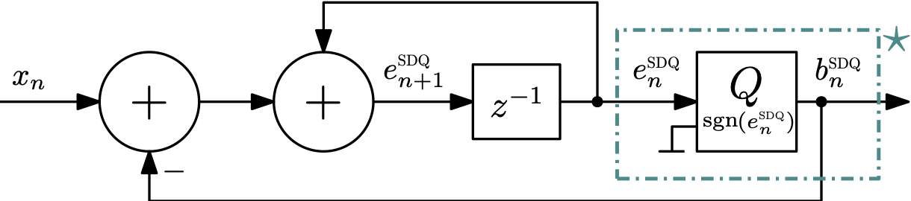

# An Optimization-Based Approach to One-Bit Quantization

**Florian Mayer**  
FH JOANNEUM - University of Applied Sciences  
Graz, Austria  
florian.mayer@fh-joanneum.at

**Christian Vogel**  
FH JOANNEUM - University of Applied Sciences  
Graz, Austria  
christian.vogel@fh-joanneum.at

> _This work was funded by the Austrian Science Fund (FWF) [10.55776/ DFH 5] and the province of Styria._

---

## Abstract

In many industrial fields, one-bit signals play an important role, such as improving the operational efficiency in a wide range of applications.  
This paper introduces a mapping function $`\mathcal{F}(\cdot)`$ that converts real-valued discrete-time signals into two-level discrete-time signals, i.e., one-bit signals. By introducing an error function, we can evaluate the quality of the mapping and can introduce different optimization strategies to minimize the error. Mathematical analysis and numerical simulations demonstrate that the optimization approach leads to specific characteristics of the quantization. The well-known Sigma-Delta modulator, for example, turns out to be a special case of the introduced optimization. The approach has the potential to introduce new ways of one-bit quantization, which can be tailored to specific applications.

**Keywords**: one-bit quantization, one-bit signal processing, sigma-delta modulation, pulse width modulation, optimization-based framework

## Table of Contents

[back to project](../readme.md)
<details>
<summary> Expand </summary>

- [Abstract](#abstract)
- [Keywords](#keywords)
- [I. Introduction](#i-introduction)
- [II. Problem Definition](#ii-problem-definition)
- [III. General Optimization](#iii-general-optimization)
- [IV. Sequential Optimization](#iv-sequential-optimization)
  - [A. Identity Matrix](#a-identity-matrix)
  - [B. Lower Triangular Matrix (LLRT)](#b-lower-triangular-matrix-llrt)
- [V. Numerical Simulations and Enhancements](#v-numerical-simulations-and-enhancements)
- [VI. Conclusions](#vi-conclusions)
- [References](#references)
- [Acknowledgment](#acknowledgment)

</details>

## I. Introduction

One-bit signals are either "on" or "off" at any given time. The use of one-bit signals makes it easier to encode, decode, and process signals with higher efficiency because the two-level signal characteristic reduces the energy required for signal processing as well as signal transmission [1]–[4].

For example, using one-bit signals in burst-mode RF transmitters allows the power amplifiers to reach peak efficiency and do not waste power during low-level periods, resulting in a higher average efficiency compared to conventional linear power amplifier [5]–[10]. In audio processing, a one-bit signal enables high sampling rates crucial for superior sound quality. It also simplifies audio processing by reducing the need for complex filtering and signal processing [11]–[13].

To convert real-valued data into a one-bit signal, temporal patterns such as pulse width, pulse position, and pulse density modulation are used. Despite their utility, these methods can have limitations in representation, reconstruction, noise sensitivity, and dynamic range [1].

The Sigma-Delta Quantizer (SDQ) achieves high resolution through oversampling and via noise shaping [12], [14], but introduces high-frequency switching that reduces the power efficiency for example in switched-mode power amplifiers. Pulse-Width Modulation (PWM) enables efficient power management but introduces distortion and aliasing due to the nonlinear PWM operator [5]. Aliasing can be circumvented by aliasing-free digital PWM (AFPWM) [5], [15], but at the cost of much higher implementation complexity [6].

Click Modulation produces a one-bit signal through equal clicks, creating a bandpass signal recoverable with a low-pass filter [16], [17]. However, uncertainties in the switching times can affect the performance, i.e., the signal-to-noise ratio, and require high implementation complexity to mitigate them [2].

This paper deals with the feasibility of an optimal one-bit representation for real-valued signals. It introduces an optimization-based one-bit-quantization (OBAQ) approach that converts real signals to their two-level representation of $`\{-1,1\}`$. This optimization produces an optimal one-bit signal for a real-valued input, despite the problem's general NP-hard nature. The paper highlights that this framework can be used to derive and explore less complex suboptimal solutions such as iterative methods [18]–[20].

It turns out that our optimization approach easily leads to the sigma-delta modulator as a particular solution. This framework is therefore a starting point for finding other optimal and suboptimal solutions for one-bit quantization with specific properties in frequency and time.

<figure>
  
</figure>

**Figure 1:** The real-valued signal $`\underline{x}`$ is mapped into a one-bit signal $`\underline{b}`$.

## II. Problem Definition

We consider a function $`\mathcal{F}(\cdot)`$ mapping a real-valued discrete-time signal
```math
\underline{x} = [x_0, x_1, \cdots, x_n, \cdots, x_{N-1}]^T \in \mathbb{X}^N = [-\alpha,\alpha]^N
```
with $`\alpha \in \mathbb{R}^{+}_0`$ and a signal length $`N`$, into a discrete-time one-bit (two-level) signal
```math
\underline{b} = [b_0, b_1, \cdots, b_n, \cdots, b_{N-1}]^T \in \mathbb{B}^N = \{-1,1\}^N,
```
that is
```math
\underline{b} = \mathcal{F}(\underline{x}). \tag{1}
```

Furthermore, we introduce a measure $`E(\underline{x}, \underline{b})`$ between the signal $`\underline{x}`$ and the signal $`\underline{b}`$. The measure $`E(\underline{x}, \underline{b})`$ could be arbitrarily defined according to the given problem.

For many practical problems, however, the physically motivated minimization of an error signal energy is used, leading to the squared $`l^2`$-norm. Therefore, for the remainder of this paper, we consider the squared $`l^2`$-norm which is given by
```math
E(\underline{x}, \underline{b}) = \|\underline{e}\|_2^2 = \sum_{n=0}^{N-1} |e_n|^2 \tag{2}
```
where the error signal $`\underline{e} \in \mathbb{R}^N`$ is defined as the difference between $`\underline{x}`$ and $`\underline{b}`$, weighted with matrix $`W`$, consisting of the coefficients $`\underline{w} = [w_0,w_1,\cdots, w_n, \cdots, w_{N-1}] \in \mathbb{R}^N`$, i.e.,
```math
\underline{e} = W \cdot (\underline{x} - \underline{b}). \tag{3}
```

The difference between $`\underline{x}`$ and $`\underline{b}`$ can be denoted as
```math
\underline{d} = \underline{x} - \underline{b},
```
and results with (2) and (3) in
```math
E(\underline{x}, \underline{b}) = \|\underline{e}\|_2^2 = \|W \cdot (\underline{x} - \underline{b})\|_2^2 = \|W \cdot \underline{d}\|_2^2. \tag{4}
```

Ideally, the mapping function (1) would minimize the error function given in (4), but for practical cases the mapping results in errors larger than the minimum error. Therefore, substituting the mapping function (1) into (4) results in
```math
E(\underline{x}, \mathcal{F}(x)) \geq \min_{\underline{\hat{b}} \in \mathbb{B}^N} E(\underline{x}, \underline{\hat{b}}), \tag{5}
```
where $`\underline{\hat{b}} \in \mathbb{B}^N`$ is the one-bit solution obtained by the optimization process.

## III. General Optimization

The mapping defined in (1) can be implemented by an optimization approach as shown in Figure 2.

<figure>
  
</figure>

**Figure 2:** General structure of the optimization-based mapping function $`\mathcal{F}(\cdot)`$, which generates a one-bit signal from a real-valued discrete-time signal.

The function $`\mathcal{F}(\cdot)`$ is nonlinear, as it maps an infinite to a finite cardinality, specifically $`\mathbb{R} \rightarrow \mathbb{B}`$. Finding an optimal one-bit representation $`\underline{b}`$, even when dealing with a single signal $`\underline{x}`$, has been shown to be a NP-hard problem [21]. Thus, minimizing $`E(\underline{x}, \underline{\hat{b}})`$ with a signal length of $`N`$ introduces $`2^N`$ possible binary combinations to be considered, resulting in an exponential growth of the search space and high computational complexity. Hence, in practice, even with fast algorithms from discrete optimization [22], [23] we are limited to small signal lengths $`N`$. By using heuristic optimization like genetic algorithms [24] and simulated annealing [25] we may find good local optima, but still need substantial computational resources. To significantly reduce the computational complexity, we need to simplify our optimization problem for finding $`\mathcal{F}(\cdot)`$.

## IV. Sequential Optimization

To obtain more feasible solutions, we replace (3) by the instantaneous error $`|e_n|^2`$ and minimize over $`b_n`$, i.e.,
```math
b_n = \arg\,\min_{\hat b_n} |e_n|^2. \tag{9}
```

At time instance $`n`$ we assume all $`e_k`$ for $`k < n`$ have already been optimized and the corresponding $`b_k`$ have been determined.  
In contrast to optimizing all elements of $`\underline{b}`$ at once, we sequentially optimize the instantaneous error just by one element $`b_n`$ at time $`n`$ while keeping the former coefficients $`b_k`$ fixed.

To end up with some realizable examples, we further assume a causal time-invariant filter (while this discussion assumes time-invariant filters for simplicity, the principles can also be applied to time-varying filters) with the coefficient vector $`\underline{w}`$ reducing the matrix $`W`$ to
```math
W =
\begin{bmatrix}
w_0 & 0 & \cdots & 0 \\
w_1 & w_0 & \ddots & \vdots \\
\vdots & & \ddots & 0 \\
w_{N-1} & \cdots & w_1 & w_0
\end{bmatrix}, \quad w_0 \neq 0. \tag{10}
```$$```

All elements above the main diagonal are zero, and arbitrary entries over $`\mathbb{R}`$ are located on or below the main diagonal.

<figure>
  
</figure>

**Figure 3:** General structure of the optimization-based mapping function $`\mathcal{F}(\cdot)`$, which generates a one-bit signal from a real-valued discrete-time signal.

With these simplifications, the error in (5) reduces to
```math
\begin{aligned}
e_0 &= w_0 \cdot d_0 + \hat{e}_0 \\
e_1 &= w_0 \cdot d_1 + \hat{e}_1 \\
&\vdots \\
e_n &= w_0 \cdot d_n + \hat{e}_n = w_0 \cdot (x_n - \hat{b}_n) + \hat{e}_n
\end{aligned} \tag{11}
```

where $`\hat{e}_n`$ is the convolution of the differences $`d_k = x_k - b_k`$ determined by the already obtained $`b_k`$ of previous steps, with the coefficients $`w = [w_1, \cdots, w_{N-1}]`$ of matrix $`W`$ given by
```math
\hat{e}_n = \sum_{k=0}^{n-1} w_{n-k} \cdot d_k + e_{\text{init}}. \tag{12}
```

Applying (11) and (12) to (9) leads to:
```math
b_n = \underset{\hat{b}_n \in \mathbb{B}}{\arg\,\min} \left( x_n - \hat{b}_n + \frac{\hat{e}_n}{w_0} \right)^2. \tag{13}
```

Since $`\hat{b}_n \in \{-1, 1\}`$, (13) can be expressed as:
```math
b_n = \text{sgn}_0 \left( x_n + \frac{\hat{e}_n}{w_0} \right) =
\begin{cases}
1, & \text{if } x_n + \frac{\hat{e}_n}{w_0} \geq 0 \\
-1, & \text{otherwise}
\end{cases}. \tag{14}
```

The lower-triangular structure of $`W`$ as well as the sequential process yields an optimization similar to the Coordinate Descent method outlined in [26].  
The minimization of the squared $`l^2`$-norm of the error signal $`e_n`$ in (9) contributes to the minimization of the global $`l^2`$-norm of the error signal in (3). It might therefore serve as a good initial vector for a further general optimization.

---

### A. Identity Matrix

We investigate the filter matrix $`W`$ being the identity matrix $`\mathcal{I}`$:
```math
W_{\mathcal{I}} =
\begin{bmatrix}
1 & 0 & \cdots & 0 \\
0 & 1 & \ddots & \vdots \\
\vdots & \ddots & \ddots & 0 \\
0 & \cdots & 0 & 1
\end{bmatrix}. \tag{15}
```

Employing $`W_{\mathcal{I}}`$ in (13) and setting $`e_{\text{init}} = 0`$ yields:
```math
b_n = \underset{\hat{b}_n \in \mathbb{B}}{\arg\,\min} \left( x_n - \hat{b}_n \right)^2. \tag{16}
```

Since $`\hat{e}_n = 0`$, the update rule becomes:
```math
b_n = \text{sgn}_0(x_n) =
\begin{cases}
1, & x_n \geq 0 \\
-1, & x_n < 0
\end{cases}. \tag{17}
```

For the identity matrix $`W_{\mathcal{I}}`$, the sequential optimization achieves the global optimum:
```math
E(\underline{x}, \mathcal{F}(x)) = \min_{\underline{b} \in \mathbb{B}^N} E(\underline{x}, \underline{b}), \quad \text{for } W = W_{\mathcal{I}}. \tag{18}
```

---

### B. Lower Triangular Matrix (LLRT)

We consider a lower-triangular matrix $`W_{\text{LLRT}}`$:
```math
W_{\text{LLRT}} =
\begin{bmatrix}
1 & 0 & \cdots & 0 \\
\vdots & 1 & \ddots & \vdots \\
\vdots & & \ddots & 0 \\
1 & \cdots & \cdots & 1
\end{bmatrix}. \tag{19}
```

Plugging $`W_{\text{LLRT}}`$ into (11) and (13) results in:
```math
e_n = x_n - \hat{b}_n + \hat{e}_n \tag{20}
```
```math
b_n = \underset{\hat{b}_n \in \mathbb{B}}{\arg\,\min} \left( x_n - \hat{b}_n + \hat{e}_n \right)^2. \tag{21}
```

The accumulated error is given by:
```math
\hat{e}_n = \sum_{k=0}^{n-1} d_k + e_{\text{init}} = \sum_{k=0}^{n-1} x_k - \sum_{k=0}^{n-1} \hat{b}_k + e_{\text{init}}. \tag{22}
```

The decision rule becomes:
```math
b_n = \text{sgn}_0(x_n + \hat{e}_n) =
\begin{cases}
1, & x_n + \hat{e}_n \geq 0 \\
-1, & x_n + \hat{e}_n < 0
\end{cases}. \tag{23}
```

The output is equivalent to a first-order Sigma-Delta Quantizer (SDQ), defined by [3]:
```math
e_{n+1}^{\text{SDQ}} = x_n - b_n^{\text{SDQ}} + e_n^{\text{SDQ}} \tag{24}
```
```math
b_n^{\text{SDQ}} = \text{sgn}_0(e_n^{\text{SDQ}}) =
\begin{cases}
1, & e_n^{\text{SDQ}} \geq 0 \\
-1, & e_n^{\text{SDQ}} < 0
\end{cases}. \tag{25}
```

<figure>
  
</figure>

**Figure 4:** General structure of a first-order Sigma-Delta Quantizer (SDQ).

By initializing the sequential method with the current SDQ error value $`e_n^{\text{SDQ}}`$, the method becomes:
```math
e_n^2 = (e_{n+1}^{\text{SDQ}} - \hat{b}_n)^2. \tag{26}
```

Thus, we obtain the next one-bit sample of the SDQ by applying the sequential optimization at time $`n`$, i.e., $`\hat{b}_n = b_{n+1}^{\text{SDQ}}`$. Therefore, the SDQ is a special case of the sequential optimization using $`W_{\text{LLRT}}`$.

## V. Numerical Simulations and Enhancements

To verify and evaluate the derivations for the sequential optimization-based mapping function $`\mathcal{F}(\cdot)`$ from Section 4, numerical simulations were conducted. Based on the choice of $`W`$ in Sections 5.1 and 5.2, we obtain the One-Bit Quantizer and the first-order Sigma-Delta Quantizer (SDQ), respectively (see Figure 5).

<figure>
  
</figure>

**Figure 5:** Applying $`W_{\mathcal{I}}`$ we obtain the One-bit Quantizer (left), while applying $`W_{LLRT}`$ yields the first-order SDQ, for $`{e}_{\text{init}} = 0`$.

To demonstrate the optimization-based approach for one-bit quantization (OBAQ), we extend the structure by plugging the coefficients of a causal non-ideal FIR lowpass filter  
$`\underline{h} = [h_0, h_1, \cdots, h_{L-1}]^T \in \mathbb{R}^N`$ (with $`L = 83 < N`$) into matrix $`W`$, forming the convolution matrix $`W_H`$.

We simulate four different signal lengths:
```math
N = \{2^9, 2^{10}, 2^{11}, 2^{12}\}.
```

Each set contains 1000 band-limited test signals $`\underline{x} \in [-1,1]^N`$ with frequency bins from 1 to 131 in steps of 3. Both the number of samples $`N`$ and the oversampling factor are scaled, keeping the maximum frequency bin constant. The cutoff for $`\underline{h}`$ is defined as $`w_c = \frac{262}{N} \pi`$.

All simulations use $`e_{\text{init}} = 0`$. The resulting one-bit signals are evaluated using the signal-to-noise ratio (SNR) [27], computed with an ideal reconstruction filter having cutoff $`w_r = \frac{264}{N} \pi`$. The results in Table 1 show the average SNR over 1000 runs per $`N`$.

**Table 1 – Performance of the One-Bit Quantization Methods**

| Filter Matrix $`W`$          | $`N = 2^9`$ | $`N = 2^{10}`$ | $`N = 2^{11}`$ | $`N = 2^{12}`$ |
|---------------------------|-----------|--------------|--------------|--------------|
| OBAQ ($`W_{\text{LLRT}}`$) [dB] | -0.46     | 7.16         | 15.79        | 24.76        |
| OBAQ ($`W_H`$) [dB]            | 2.92      | 9.77         | 17.70        | 26.05        |
| Oversampling Factor        | 1.95      | 3.91         | 7.82         | 15.63        |

The use of $`W_H`$, due to its lowpass characteristics, effectively shapes the quantization noise outside the band specified by $`w_c`$. As Figure 6 and Table 1 show, even at lower oversampling rates, the SNR can be significantly improved. Thus, the filter matrix $`W`$ effectively determines quantization behavior without requiring algorithmic changes to the quantizer.

We also evaluate three initial vectors for the general optimization process using MATLAB’s Genetic Algorithm (GA) [28] with a 60-second time limit:
- a random vector $`v_{\text{rand}}`$
- the result of OBAQ using $`W_{\text{LLRT}}`$
- the result of OBAQ using $`W_H`$

The vector $`\underline{b}_{W_H}`$ offers a strong initialization that helps converge faster to robust local minima compared to random initialization, with significantly lower optimization time.

<figure>
  
</figure>

**Figure 5:** The outputs of the proposed quantization process using $`W_{LLRT}`$ (top) and $`W_H`$ (bottom). Comparing both spectra shows that employing $`W_H`$ tends to process the noise to the frequency bins grater than $`w_c`$. The red dashed line depicts an ideal reconstruction filter, employed for the SNR calculation.

## VI. Conclusions

We presented a framework, denoted $`\mathcal{F}(\cdot)`$, for mapping real-valued discrete-time signals to their one-bit representations. The approach is based on the minimization of an error function $`E(\underline{x}, \underline{b})`$, which quantifies the deviation between the original signal $`\underline{x}`$ and its binary representation $`\underline{b}`$ using the squared $`l^2`$-norm.

To obtain a one-bit signal, discrete optimization tools such as Gurobi, CVX, or MATLAB’s Global Optimization Toolbox can be used. However, these methods are not always well-suited for real-time applications, as they demand significant computational resources to identify a local minimum.

To address this challenge, we proposed a sequential optimization approach with linear complexity $`\mathcal{O}(N)`$.  
This approach allows for fast and scalable implementation, while still preserving a meaningful error minimization mechanism.

Notably, the framework allows modeling specific quantization behaviors — such as harmonic shaping — through the structure of the filter matrix $`W`$. By carefully designing $`W`$, one can simulate or enforce desired spectral properties of the one-bit signal.

Future work may include:
- using the fast sequential quantization output as an initialization for global optimization processes,
- converting the matrix $`W`$ into a block-recursive form, potentially reducing the complexity and relaxing the NP-hardness by increasing local independence across coefficients.

## References
<details>
<summary>Expand</summary>


## References

[1] A. Sevuktekin and H. Boche, “Signal Processing with 1-bit Quantization: An Overview,” *IEEE Signal Processing Magazine*, vol. 36, no. 3, pp. 141–158, May 2019.

[2] L. Stefanazzi, S. Cangiano, and S. Reggiani, “Click modulation for audio amplification: a comparison of methods,” in *Proc. IEEE MWSCAS*, 2008.

[3] S. Khobahi and M. Soltanalian, “Model-based deep learning for one-bit compressive sensing,” *IEEE Transactions on Signal Processing*, vol. 68, pp. 3168–3182, 2020.

[4] S. Khobahi, S. Hosseini, and M. Soltanalian, “Deep signal recovery with one-bit quantization,” in *Proc. IEEE ICASSP*, 2019.

[5] D. Hausmair, C. Vogel, and M. Rupp, “Aliasing-free digital PWM for switching audio amplifiers,” *IEEE Transactions on Circuits and Systems I: Regular Papers*, vol. 60, no. 6, pp. 1452–1465, Jun. 2013.

[6] D. Hausmair, C. Vogel, and M. Rupp, “Multiplierless sigma–delta modulation,” *IEEE Transactions on Circuits and Systems II: Express Briefs*, vol. 60, no. 9, pp. 565–569, Sep. 2013.

[7] D. Hausmair and M. Rupp, “How to Evaluate the Performance of PWM-based Audio Amplifiers,” in *Proc. IEEE ISCAS*, 2013.

[8] S. Chi, C. Vogel, and M. Rupp, “Coding with PWM for Audio Amplifiers,” in *Proc. MWSCAS*, 2011.

[9] S. Chi, C. Vogel, and M. Rupp, “Frequency-Domain PWM for Digital Audio Amplifiers,” in *Proc. ICECS*, 2010.

[10] C. Enzinger and C. Vogel, “Analytical Description of Aliasing-Free Digital PWM,” in *Proc. IEEE ISCAS*, 2014.

[11] J. Reefman and A. J. M. Janssen, “One-bit sigma-delta modulation with improved signal to noise ratio,” *Journal of the Audio Engineering Society*, vol. 52, no. 3, pp. 224–235, Mar. 2004.

[12] J. D. Reiss, “Understanding Sigma Delta Modulation: The Solved and Unsolved Issues,” *Journal of the Audio Engineering Society*, vol. 56, no. 1/2, pp. 49–64, Jan. 2008.

[13] D. Kershaw and M. Sandler, “Sigma-delta modulation: an overview,” in *IEE Colloquium on Oversampling A/D and D/A Conversion*, 1993.

[14] R. Schreier and G. C. Temes, *Understanding Delta-Sigma Data Converters*, Wiley, 2017.

[15] R. Chierchie and M. Paolini, “Digital PWM with band limitation and aliasing reduction,” *IEEE Transactions on Circuits and Systems II: Express Briefs*, vol. 65, no. 4, pp. 464–468, Apr. 2018.

[16] B. Logan, “Click modulation for digital signal synthesis,” *AT&T Bell Laboratories Technical Journal*, vol. 63, no. 8, pp. 1423–1436, Oct. 1984.

[17] C. Burrus, “Block realization of digital filters,” *IEEE Transactions on Audio and Electroacoustics*, vol. 20, no. 4, pp. 230–235, Oct. 1972.

[18] M. R. Garey and D. S. Johnson, *Computers and Intractability: A Guide to the Theory of NP-Completeness*, W. H. Freeman, 1979.

[19] M. Yuan and B. Ghanem, “An exact penalty method for binary optimization,” in *Proc. AAAI Conf. Artificial Intelligence*, 2017.

[20] S. Chae and S. Hong, “A Greedy Algorithm for Binary Optimization in One-Bit Compressed Sensing,” *IEEE Transactions on Signal Processing*, vol. 68, pp. 5462–5476, 2020.

[21] Gurobi Optimization LLC, *Gurobi Optimizer Reference Manual*, 2023. [Online]. Available: https://www.gurobi.com

[22] M. Grant and S. Boyd, “CVX: Matlab software for disciplined convex programming,” version 2.2, 2014. [Online]. Available: http://cvxr.com/cvx

[23] M. Srinivas and L. M. Patnaik, “Genetic Algorithms: A Survey,” *Computer*, vol. 27, no. 6, pp. 17–26, Jun. 1994.

[24] J. Delahaye, C. Dhaenens, Q. Dufour, and D. R. Martí, *Simulated Annealing: Advances, Applications and Hybridizations*, Springer, 2019.

[25] A. V. Oppenheim and R. W. Schafer, *Discrete-Time Signal Processing*, 3rd ed., Pearson, 2013.

[26] S. J. Wright, “Coordinate descent algorithms,” *Mathematical Programming*, vol. 151, no. 1, pp. 3–34, Jun. 2015.

[27] MathWorks, “Global Optimization Toolbox User’s Guide,” R2022a. [Online]. Available: https://www.mathworks.com/help/gads/

</details>

## Acknowledgment

This research was funded by the Austrian Science Fund (FWF) [10.55776/ DFH 5] within the DENISE project, and the province of Styria.

## License

This work is licensed under the [Creative Commons Attribution-NonCommercial 4.0 International License (CC BY-NC 4.0)](https://creativecommons.org/licenses/by-nc/4.0/).
You are free to use, adapt, and share it **for non-commercial purposes**, provided that you **credit the original author**.

© [Florian Mayer], [2025]
