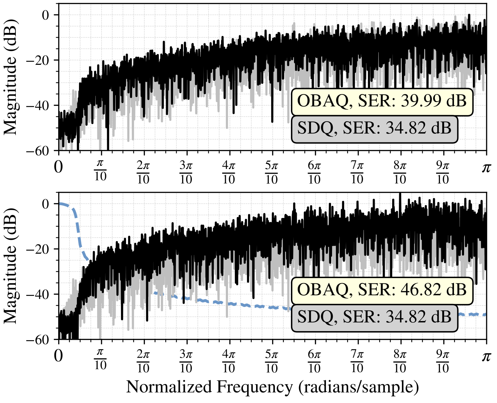

# Block-Based Optimization for Frequency-Selective One-Bit Quantization

**Florian Mayer**  
FH JOANNEUM - University of Applied Sciences  
Graz, Austria  
florian.mayer@fh-joanneum.at

**Christian Vogel**  
FH JOANNEUM - University of Applied Sciences  
Graz, Austria  
christian.vogel@fh-joanneum.at

> _This work was funded by the Austrian Science Fund (FWF) [10.55776/ DFH 5] and the province of Styria._

---

**Abstract:**  

One-bit quantization converts real-valued signals into binary sequences, offering significant hardware simplification advantageous for low-power and real-time applications. However, it introduces considerable quantization noise, challenging signal quality, especially for signals with spectral complexity. Traditional methods like Sigma-Delta Quantization (SDQ) effectively mitigate quantization noise for lowpass signals by pushing it outside the signal bandwidth, but struggle with more complex spectral requirements.

We present a block-based optimization framework (OBBQ) for one-bit quantization, which divides signals into smaller blocks, and optimizes each block independently. By formulating quantization as an optimization problem, our method enhances signal reconstruction accuracy and enables precise noise shaping adaptable to complex spectral content. It outperforms traditional SDQ methods in both flexibility and fidelity, facilitating real-time processing across various desired frequency domains.

**Keywords:** one-bit quantization, block-based optimization, one-bit signal processing, noise shaping

## Table of Contents

[back to project](../readme.md)
<details>
<summary> Expand </summary>

- [I. Introduction](#i-introduction)
- [II. Problem Definition](#ii-problem-definition)
- [III. Optimization for One-Bit Quantization](#iii-optimization-for-one-bit-quantization)
- [IV. Block Optimization](#iv-block-optimization)
  - [A. Block Realization of the Signals and Matrices](#a-block-realization-of-the-signals-and-matrices)
  - [B. Block-Wise Optimization Process](#b-block-wise-optimization-process)
  - [C. Complexity and Importance of the Filter Selection](#c-complexity-and-importance-of-the-filter-selection)
- [V. Numerical Simulations and Enhancements](#v-numerical-simulations-and-enhancements)
  - [A. Lowpass Signal](#a-lowpass-signal)
  - [B. Bandpass Signal](#b-bandpass-signal)
- [Conclusions](#conclusions)
- [Acknowledgment](#acknowledgment)
- [License](#license)

</details>

## I. Introduction

A binary signal, defined as a one-bit signal with a binary state of "on" or "off," is an elementary yet effective form of digital representation. Its two-level structure not only facilitates signal processing but also provides benefits in terms of energy efficiency and data transmission [2], [1].

Encoding real-valued signals into binary sequences significantly reduces the complexity of hardware systems. As a result, one-bit quantization offers an attractive option for low-power and real-time applications [3], [4]. Nevertheless, this efficiency is achieved at the expense of increased quantization noise, which presents a challenge in maintaining signal quality.

Sigma-Delta Quantization (SDQ) mitigates quantization noise by shaping it outside of the signal bandwidth, making it a widely used method in audio, communication, and other signal processing applications for improving the signal-to-noise ratio (SNR) [3], [1], [5]. However, SDQ systems are primarily suited for lowpass signals and struggle to handle more complex spectral requirements.

Using one-bit signals in burst-mode RF transmitters allows the power amplifiers to reach peak efficiency and do not waste power during low-level periods, resulting in a higher average efficiency compared to conventional linear power amplifiers [6-10], [4]. Pulse-Width Modulation (PWM) efficiently manages power but introduces distortion and aliasing, which aliasing-free PWM (AFPWM) mitigates with higher complexity [6], [11]. Click Modulation generates a one-bit signal that is recoverable via lowpass filtering, though switching time uncertainties can impact performance [12],[13].

Optimization-based one-bit quantization offers precise control over noise shaping by treating it as an optimization problem. Some methods use maximum-likelihood sequence detection (MLSD) with algorithms like the Viterbi algorithm, while more efficient alternatives such as the M-Algorithm balance performance and complexity [14]. Sequential methods minimize the error between real-valued and one-bit signals, offering scalability for real-time applications but becoming computationally demanding for long signals [15],[16].

To address this, we introduce a block-based optimization framework (OBBQ) that converts real signals into their two-level representation $\{-1,1\}$ by dividing them into smaller blocks. This approach significantly reduces the optimization complexity, improves signal reconstruction, and adapts to signals with distinct spectral characteristics while maintaining effective noise shaping. While our evaluations focus on lowpass and bandpass signals, the framework is, in principle, extendable to highpass signals, making it an ideal candidate for real-time and low-power applications.

## II. Problem Definition

<figure>
  
</figure>

**Figure 1:** The input signal $`\underline{x}`$ is quantized to $`\underline{b}`$ by $`\mathcal{F}(\cdot)`$, then reconstructed to $`\underline{x}_r`$ by employing $`R`$.

Let $\mathcal{F}(\cdot)$ be a function that maps a real-valued discrete-time signal $`\underline{x} = [x_0, x_1, \ldots, x_n, \ldots, x_{N-1}]^T \in \mathbb{X}^N=[-\alpha,\alpha]^N`$ with $`\alpha \in \mathbb{R}^{+}_0`$ and a signal length $N$, into a discrete-time one-bit signal $`\underline{b} = [b_0, b_1, \ldots, b_n, \ldots, b_{N-1}]^T \in \mathbb{B}^N  = `$ {$`-1`$, $` 1`$ }$`^N`$, introduced in [15] and defined as
```math
\underline{b} = \mathcal{F}(\underline{x}).\tag{1}
```

We assume that the signal $`\underline{x}`$ is band-limited, with significant energy within a defined frequency domain $`\omega_D`$, and negligible energy outside, such that
```math
X(\omega) = \textit{DTFT}\{\underline{x}\} \cong 0 \quad \text{for} \quad \omega \notin \omega_D.\tag{2}
```

As shown in Figure 1, the reconstructed signal $\underline{x}_r$ is given by
```math
\underline{x}_r = R \cdot \underline{b},\tag{3}
```
where $`R`$ is the reconstruction filter matrix.

To evaluate the performance of the one-bit quantizer $`\mathcal{F}(\cdot)`$, we need to define the reconstruction error.  
Since in practice $R$ is a non-ideal filter
```math
\underline{x}_f = R\cdot \underline{x} \neq \underline{x},\tag{4} 
```
we introduce an filter-independent reconstruction error 
```math
\underline{e} = \underline{x}_f - \underline{x}_r = R \cdot \underline{x} - R \cdot \underline{b} = R \cdot \underline{d}, \tag{5}
```
where the difference between $`\underline{x}`$ and $`\underline{b}`$ is denoted as 
```math
\underline{d} = \underline{x} - \underline{b}. \tag{6}
```

To determine the error between the signal $`\underline{x}`$ and $`\underline{b}`$, we introduce a measure $`{E}(\underline{x},\underline{b})`$.  
For many practical problems, it is common to minimize the energy of the error signal employing the squared $`l^2`$-norm, given by
```math
E(\underline{x},\underline{b}) = \|\underline{e}\|_2^2 = \sum_{n=0}^{N-1} |e_n|^2 = \|R \cdot \underline{d}\|_2^2, \tag{7}
```
where the optimal mapping function (1) would minimize the error function defined in (7). However, practical implementations of the mapping function {will most likely} lead to measures that are larger than the theoretical minimum, i.e., 
```math
{E}(\underline{x},\mathcal{F}(\underline{x})) \geq \underset{\underline{{b}}^{\ast} \in \mathbb{B}^N}{\text{min}}~{E}(\underline{x},\underline{{b}}^{\ast}), \tag{8}
```
where $`{\underline{{b}}^{\ast} \in \mathbb{B}^N}`$ is the optimal solution and (1) is the best solution of the function $`\mathcal{F}(\underline{x})`$.

## III. Optimization for One-Bit Quantization

In practice, determining the optimal one-bit representation $`\underline{b}`$ for a given signal $`\underline{x}`$ through the nonlinear function $`\mathcal{F}(\cdot)`$, which maps an infinite set of real values to a finite set of binary values $`(\mathbb{R} \rightarrow \mathbb{B})`$, is classified as an NP-hard problem [16]. Minimizing $`E(\underline{x},\underline{\hat{b}})`$ for a signal of length $`N`$ involves evaluating $`2^N`$ binary combinations, leading to exponential growth in the search space and significant computational challenges.

As shown in Figure 2, we can use an optimization to find the best or at least good solutions for $`\mathcal{F}(\cdot)`$, where we may or may not use the reconstruction matrix $`R`$ for the filter matrix $`W`$. Fast algorithms from discrete optimization, such as those provided by the Gurobi optimizer [17] and CVX [18], are effective for small signal lengths $N$, but their computational demands increase significantly as the signal length grows.

Heuristic optimization methods, like genetic algorithms [19] and simulated annealing [20], can find good local optima. However, these methods still require significant computational resources and often converge to local minima, resulting in suboptimal quantized signals. By adopting simpler sequential optimization techniques [15], we can significantly reduce the computational complexity of the optimization problem for $\mathcal{F}(\cdot)$. Although this approach speeds up the process, it intentionally sacrifices global optimality in favor of a local measure.

## IV. Block Optimization

<figure>
  
</figure>

**Figure 2:** General structure of the quantization process $\mathcal{F}(\cdot)$, generating a one-bit signal from a real-valued discrete-time signal.

To make an optimization approach feasible and practically applicable, we consider a block-based optimization, where only small finite number of bits $M$, are optimized at once, and the errors are further propagated from one optimization block to the next.  
For signals of finite length $N$, we consider therefore a finite linear time-invariant impulse response (FIR) filter $`\underline{w} = [w_0, w_1, \cdots, w_n, \cdots, w_{L-1}] \in \mathbb{R}^L`$ with filter length $`L`$, and partition the filter matrix $`W`$ of size $`N \times N`$ into smaller submatrices $`\hat{W}^{(k)}`$ of size $`M \times M`$ blocks.

### A. Block Realization of the Signals and Matrices

We divide the input signal $`\underline{x}`$ and the one-bit signal $`\underline{\hat{b}}`$ into $`P`$ blocks, each of length $`M`$, such that $`P = \lceil \frac{N}{M} \rceil`$ as in [21, 22]. Therefore, the signals are represented as $`\underline{x} = [(\underline{x}^{(0)})^{T}, \cdots, (\underline{x}^{(P-1)})^T]^T`$ with $`(\underline{x}^{(p)})^{T} \in \mathbb{R}^M`$ and $`\underline{b} = [(\underline{b}^{(0)})^T, \cdots, (\underline{b}^{(P-1)})^T]^T`$ with $`(\underline{b}^{(p)})^T \in \mathbb{B}^M`$, for $`p = 0, 1, \ldots, P-1`$.

The filter matrix $`W`$ is expressed as a block matrix containing $`M \times M`$ submatrices, such that

```math
W = \begin{bmatrix}
    \hat{W}^{(0)} & O & \cdots & O \\
    \hat{W}^{(1)} & \hat{W}^{(0)} & \ddots & \vdots \\
    \vdots & \vdots & \ddots & O \\
    \hat{W}^{(P-1)} & \hat{W}^{(P-2)} & \cdots & \hat{W}^{(0)}
\end{bmatrix},\tag{9}
```

where $`O`$ is the $`M \times M`$ zero matrix. Each block matrix $`\hat{W}^{(k)}`$ represents the filter’s contribution from the previous block step $`k`$, and is constructed from the filter coefficients $`w_n`$.

The entries of $`\hat{W}^{(k)}`$ are defined as

```math
\hat{W}^{(k)}_{ij} = 
\begin{cases} 
    w_{kM + i - j}, & \text{if } 0 \leq kM + i - j < L \\
    0, & \text{otherwise},
\end{cases}\tag{10}
```

where $`\hat{W}^{(k)}_{ij}`$ is the element at the $`i`$-th row and $`j`$-th column of block matrix $`\hat{W}^{(k)}`$.

For example, with $`M = 4`$ and $`L = 9`$, the resulting block matrices $`\hat{W}^{(0)}, \hat{W}^{(1)}, \hat{W}^{(2)}`$, and the zero matrix $`O`$ are structured as follows:

```math
\hat{W}^{(0)} = 
\begin{bmatrix}
    w_0 & 0   & 0   & 0 \\
    w_1 & w_0 & 0   & 0 \\
    w_2 & w_1 & w_0 & 0 \\
    w_3 & w_2 & w_1 & w_0
\end{bmatrix},
\quad
\hat{W}^{(1)} = 
\begin{bmatrix}
    w_4 & w_3 & w_2 & w_1 \\
    w_5 & w_4 & w_3 & w_2 \\
    w_6 & w_5 & w_4 & w_3 \\
    w_7 & w_6 & w_5 & w_4
\end{bmatrix}, \tag{11}
```

```math
\hat{W}^{(2)} = 
\begin{bmatrix}
    w_8 & w_7 & w_6 & w_5 \\
    0   & w_8 & w_7 & w_6 \\
    0   & 0   & w_8 & w_7 \\
    0   & 0   & 0   & w_8
\end{bmatrix}, \quad
O = 
\begin{bmatrix} 
    0 & 0 & 0 & 0 \\ 
    0 & 0 & 0 & 0 \\
    0 & 0 & 0 & 0 \\
    0 & 0 & 0 & 0
\end{bmatrix}.\tag{12}
```

The lower-triangular structure of $`W`$ reflects the causality of the filter, ensuring that each block depends only on the current and previous blocks.

<figure>
  
</figure>

**Figure 3:** The representation of $`\mathcal{F}(\cdot)`$ block-wise optimization process that minimizes the error $`{E}(\underline{x}^{(p)},\underline{\hat b}^{(p)})`$ for every $`p`$-th $`M`$ sized block of the signal length $`N`$.

### B. Block-Wise Optimization Process

The one-bit signal at block $p$ is found by minimizing the error energy
```math
\underset{\underline{\hat b}^{(p)} \in \mathbb{B}^M}{\text{min}}~{E}(\underline{x}^{(p)},\underline{\hat b}^{(p)}) =  \left\| \underline{\hat{e}}^{(p)} \right\|_2^2. \tag{13}
```

Due to the lower-triangular structure of $`{W}`$, we can express the error for block $`p`$ as
```math
\underline{\hat{e}}^{(p)} = \hat{W}^{(0)} (\underline{x}^{(p)} - \underline{\hat{b}}^{(p)}) + \underline{\hat{c}}_e^{(p)}, \tag{14}
```

where $`\hat{W}^{(0)}`$ is the main block diagonal of $`{W}`$, and $`\underline{\hat{c}}_e^{(p)}`$ is the accumulated error from previous blocks
```math
\underline{\hat{c}}_e^{(p)} = \begin{cases} 
    \sum_{k=1}^{p} \hat{W}^{(k)} (\underline{x}^{(p - k)} - \underline{\hat{b}}^{(p - k)}), & \text{if } p \geq k \\
    \underline{0}, & \text{otherwise}
\end{cases}.  \tag{15}
```

In this formulation, $`\hat{W}^{(k)}`$ represents the weight matrices corresponding to the filter's impulse response at block step $`k`$. The lower-triangular structure ensures that for $k \geq 1$, the matrices $`\hat{W}^{(k)}`$ involve only the already determined $`\underline{\hat{b}}^{(p - k)}`$ from previous blocks. The optimization problem for block $`p`$ simplifies to:
```math
\underline{\hat{b}}^{(p)} = \underset{\underline{\hat{b}}^{(p)} \in \mathbb{B}^M}{\arg\min} \left\| \hat{W}^{(0)} (\underline{x}^{(p)} - \underline{\hat{b}}^{(p)}) + \underline{\hat{c}}_e^{(p)} \right\|_2^2. \tag{16}
```

Finding $`\underline{\hat{b}}^{(p)}`$ minimizes the $`l^2`$-norm in (13), which depends on the current block and the accumulated error from previous blocks, as shown in (15) and illustrated in Figure 3.

### C. Complexity and Importance of the Filter Selection

Ideally, the optimization shapes the quantization errors to the frequency domain $`\omega \notin \omega_D`$, which corresponds to the inverse of $`W(z)`$, i.e., the z-transform of $`\underline{w}`$. Furthermore, by using block-optimization, we optimize over $`M`$ coefficients in $`\hat{W}^{(0)}`$.

It turns out that using a minimum-phase system for $`\underline{w}`$ significantly improves the block optimization results. In such systems, all zeros of the transfer function $W(z)$ lie inside the unit circle in the $`z`$-domain (i.e., $`|z_i| < 1`$ for all zeros $`z_i`$ of $`W(z)`$), ensuring the stability of the inverse system $`W(z)^{-1}`$. Moreover, because the impulse response of a minimum-phase system decays rapidly, the most significant filter coefficients are concentrated in $`\hat{W}^{(0)}`$. Therefore, we efficiently reduce the overall error, as contributions from later coefficients (in $`\hat{W}^{(k)}`$ for $`k > 0`$) are less impactful due to rapid energy decay.

While optimizing over the entire signal length $`N = M \cdot P`$ has complexity $`\mathcal{O}(2^{(M \cdot P)})`$, the block-wise method reduces this to $`\mathcal{O}(2^M \cdot P)`$, significantly lowering the cost for large $`N`$. This reduction in complexity comes without sacrificing the ability to capture more global information across the signal. Although the optimal solution, $`\underline{b}^{\ast}`$, achieves the lowest error, it remains computationally prohibitive for large-scale problems.

## V. Numerical Simulations and Enhancements

In order to validate the proposed block-based optimization for one-bit quantization (OBBQ), we investigate a lowpass signal and a band-pass signal. These simulations show the algorithm's performance in shaping quantization noise while maintaining a high signal-to-error ratio  
```math
\text{SER} = 10 \log_{10}\left(\frac{||\underline{x}||^2_2}{||\underline{e}||^2_2}\right)\text{dB}.
```

### A. Lowpass Signal

We designed a multitone signal with uniformly distributed frequency bins within the band $`\omega_D = \left[0, \frac{166}{4096} \pi\right]`$ and randomly assigned phases between $`0`$ and $`2\pi`$. The signal is normalized such that $`\underline{x} \in [-1, 1]^N`$, with a length of $`N = 4096`$ samples.  
For the quantization process, we employed a minimum-phase FIR lowpass filter $`W`$ with a cutoff frequency of $`\omega_c = \frac{166}{4096} \pi`$ and a filter length of $`L = 163`$, using a block size of $`M = 32`$ samples.  
The reconstruction and SER calculations were performed using an ideal reconstruction filter $`R`$ with the same cutoff frequency, $`\omega_r = \frac{166}{4096}\pi`$.

<figure>
  
</figure>

**Figure 4:** Spectrum of SDQ (gray line) compared to OBAQ (top) and OBBQ (bottom) for a lowpass signal. The OBBQ achieves improved noise shaping and SER (46.82 dB) compared to OBAQ (39.99 dB) and SDQ (34.82 dB).

<figure>
  
</figure> 

**Figure 5:** Spectrum of the difference between the input signal and the outputs of the SDQ, OBAQ, and OBBQ. The OBBQ demonstrates effective noise shaping, with the noise spectrum shaping inversely to the filter response (dashed line).

The performance of the proposed OBBQ was compared to the optimization-based one-bit quantization (OBAQ) [15], which follows a similar process to SDQ but incorporates filter coefficients instead of uniform weighting.  
As shown in Figure 4 and Figure 5, the proposed method shapes the quantization noise, keeping it outside the desired signal domain $\omega_D$, achieving an SER of 46.82 dB, compared to 39.99 dB for the OBAQ.  
The improvement can be attributed to the algorithm's enhanced capacity to distribute noise according to the intended frequency response.

<figure>
  
</figure>

**Figure 6:** The proposed block-based one-bit quantizer (OBBQ) also demonstrates effective noise shaping for bandpass signals, with the noise outside the band of interest (a) shaped inversely to the filter response shown by the dashed line (b), illustrating its adaptability in bandpass quantization.

### B. Bandpass Signal

For the quantization of a bandpass signal, we also designed a multitone signal with uniformly distributed frequency bins within the band $`\omega_D = \left[\frac{616}{4096}\pi, \frac{862}{4096}\pi\right]`$ and randomly assigned phases between $`0`$ and $`2\pi`$.  
The signal was normalized to $`\underline{x} \in [-1, 1]^N`$, with a length of $`N = 4096`$ samples. We applied a minimum-phase FIR bandpass filter with cutoff frequencies matching the boundaries of $\omega_D$ and a filter length of $`L = 141`$, using a block size of $`M = 32`$ samples.

As shown in Figure 6, the OBBQ shaped the quantization noise effectively outside the band of interest, achieving an SER of 40.06 dB while suppressing noise effectively outside the bandpass domain $\omega_D$.

A direct comparison with the SDQ and the OBAQ was not feasible, as both methods only work effectively for lowpass signals. This scenario highlights the flexibility of the proposed method, which effectively handles the quantization for desired frequency bands.

## Conclusions

This paper introduced a block-based optimization framework for one-bit quantization (OBBQ), demonstrating its flexibility in handling various frequency bands. The ability to shape noise outside of a desired signal bandwidth $`\omega_D`$, as shown in Section V, highlights the versatility of this approach.

The block-wise structure reduces computational complexity while maintaining high accuracy, making it suitable for applications with limited resources and highlighting its potential to further advance one-bit quantization techniques. This flexible approach adapts to diverse signal processing challenges, delivering competitive performance. Additionally, using smaller block sizes $`M`$ for optimization suggests that this approach could be implemented on resource-constrained platforms such as microcontrollers or real-time embedded systems. Although this aspect has not been explored in detail in this paper, it opens up promising opportunities for future research, where the algorithm could be adapted for efficient real-time processing. Future work could also explore optimizing the framework for different types of filters or integrating adaptive techniques such as machine learning to further enhance performance.

<details>
<summary>Open Literature </summary>

## Literatur

[1] J. Schreier and G. C. Temes, *Understanding Delta-Sigma Data Converters*, 2nd ed. Piscataway, NJ: IEEE Press, 2017.

[2] N. Sevuktekin, et al., "Signal Processing with One-Bit Quantizers: Challenges and Applications," *IEEE Signal Processing Magazine*, vol. 36, no. 5, pp. 51–61, 2019.

[3] J. D. Reiss, "Understanding Sigma-Delta Modulation: The Solved and Unsolved Issues," *Journal of the Audio Engineering Society*, vol. 56, no. 1/2, pp. 49–64, 2008.

[4] S. Chi, "Frequency-Domain Digital Signal Processing for Energy-Efficient Burst-Mode RF Transmitters," Ph.D. dissertation, Univ. California, Los Angeles, CA, USA, 2010.

[5] D. Kershaw, "Sigma-Delta Modulators: From Basics to Applications," *IEEE Transactions on Circuits and Systems II: Analog and Digital Signal Processing*, vol. 40, no. 10, pp. 677–683, 1993.

[6] N. Hausmair, et al., "Aliasing-Free Pulse Width Modulation for RF Applications," *IEEE Transactions on Microwave Theory and Techniques*, vol. 61, no. 6, pp. 2193–2204, 2013.

[7] N. Hausmair, et al., "Multiplierless Digital Modulation Techniques for Efficient RF Transmitter Design," *IEEE Transactions on Circuits and Systems I*, vol. 60, no. 7, pp. 1890–1903, 2013.

[8] N. Hausmair, et al., "How to Achieve High Efficiency in RF Transmitters Using Digital Techniques," *IEEE Microwave Magazine*, vol. 14, no. 1, pp. 34–43, 2013.

[9] S. Chi, et al., "Coding Efficiency and Spectral Performance in RF Transmitters," *IEEE Transactions on Communications*, vol. 59, no. 5, pp. 1285–1295, 2011.

[10] S. Chi, "Signal Processing for Energy-Efficient Burst-Mode RF Transmitters," Ph.D. thesis, unpublished.

[11] S. Enzinger, et al., "Analytical Assessment of Aliasing-Free PWM Techniques," *IEEE Transactions on Industrial Electronics*, vol. 61, no. 4, pp. 1648–1657, 2014.

[12] B. F. Logan, "Click Modulation," *Bell System Technical Journal*, vol. 63, no. 3, pp. 491–506, 1984.

[13] F. Chierchie, et al., "Digital Click Modulation: Theory and Application," *IEEE Transactions on Signal Processing*, vol. 66, no. 17, pp. 4564–4575, 2018.

[14] K. Gopalan, "Optimization Approaches for One-Bit Quantization," *IEEE Signal Processing Letters*, vol. 16, no. 5, pp. 409–412, 2009.

[15] F. Mayer, et al., "Optimization-Based Approaches to One-Bit Quantization," in *Proc. IEEE International Symposium on Circuits and Systems (ISCAS)*, 2024, pp. 1–5.

[16] S. Bhadane, "One-Bit Quantization Methods for Efficient Signal Representation," *IEEE Access*, vol. 10, pp. 10234–10245, 2022.

[17] X. Yuan, "Exact and Approximate Solutions to NP-Hard Optimization Problems," *Optimization Methods and Software*, vol. 32, no. 4, pp. 877–895, 2017.

[18] Gurobi Optimization LLC, "Gurobi Optimizer Reference Manual," 2023. [Online]. Available: https://www.gurobi.com

[19] M. Grant and S. Boyd, "CVX: Matlab Software for Disciplined Convex Programming," version 2.1, 2014. [Online]. Available: http://cvxr.com/cvx

[20] M. Srinivas and L. M. Patnaik, "Genetic Algorithms: A Survey," *IEEE Computer*, vol. 27, no. 6, pp. 17–26, 1994.

[21] D. Delahaye, et al., "Simulated Annealing: Basics and Applications in Signal Processing," *IEEE Signal Processing Magazine*, vol. 36, no. 1, pp. 32–41, 2019.

[23] C. S. Burrus, “Block realization of digital filters,” IEEE Transactions on Audio and Electroacoustics, vol. 20, no. 4, pp. 230–235, Oct. 1972.

[24] H. Voelcker and E. Hartquist, “Digital filtering via block recursion,” IEEE Transactions on Audio and Electroacoustics, vol. 18, no. 2, pp. 169–176, Jun. 1970. [Online]. Available: http://ieeexplore.ieee.org/

</details>

## Acknowledgment

This research was funded by the Austrian Science Fund (FWF) [10.55776/ DFH 5] within the DENISE project, and the province of Styria.

## License

This work is licensed under the [Creative Commons Attribution-NonCommercial 4.0 International License (CC BY-NC 4.0)](https://creativecommons.org/licenses/by-nc/4.0/).
You are free to use, adapt, and share it **for non-commercial purposes**, provided that you **credit the original author**.

© [Florian Mayer], [2025]