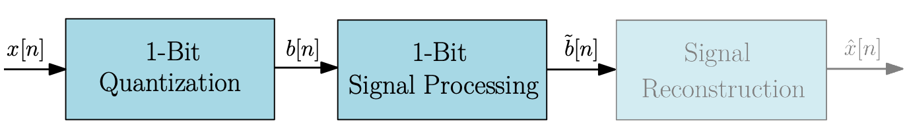
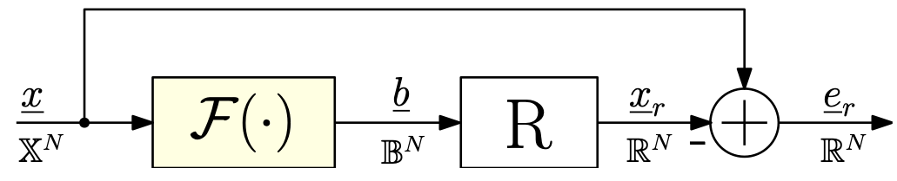

# Robust Quantization and Processing for One-Bit Signals

> This work was funded by the Austrian Science Fund (FWF) [10.55776/ DFH 5] and the province of Styria.

## Derivative Works

 Expand 

- [An Optimization-Based Approach to One-Bit Quantization](41_ISCAS2024/README.md)
- [Block-Based Optimization for Frequency-Selective One-Bit Quantization](42_ISCAS2025/README.md)

## Introduction

One-bit signals are binary-valued sequences in which each sample is either 'on' or 'off', yielding significant gains in encoding simplicity, storage, and processing efficiency [1]. This binary nature has enabled practical applications across digital signal processing, analog-to-digital conversion, communication systems, and especially compressive sensing, where it facilitates sparse signal recovery from high-dimensional data [2]. Enhancements via deep learning, including model-based reconstruction architectures, further boost recovery fidelity [3,4].

In audio applications, one-bit techniques enable increased sampling rates and reduce system complexity [5–7]. In RF systems, particularly burst-mode transmitters, one-bit quantization maximizes amplifier efficiency by eliminating power waste during inactive periods [8–13]. In resource-constrained applications such as IoT or edge computing, one-bit networks promote energy-efficient model architectures [14].

The implications of low-precision quantization on communication capacity have also been studied extensively [15,16], while modern CMOS and time-encoding ADC developments facilitate real-world adoption [17–19].

<figure>
  
</figure>

**Figure 1:** Block diagram of discrete-time one-bit processing 

## One-Bit Quantization
Real-valued signals can be transformed into binary form via pulse-width, pulse-position, or density modulation. However, these approaches often suffer from noise sensitivity and limited dynamic range [20]. Sigma-Delta Quantization (SDQ) employs oversampling and noise shaping to achieve high resolution [6,21], yet its high switching activity compromises power efficiency. PWM-based systems provide improved efficiency but exhibit spectral distortion unless aliasing is mitigated [8,22]. Alias-free variants of PWM exist [9], but add significant implementation complexity.

Click Modulation produces one-bit output through periodic switching pulses, enabling bandpass reconstruction using low-pass filters [23,24]. However, it is prone to switching-time errors and high hardware requirements [25].

<figure>
  
</figure>

**Figure 2:** Reconstruction from one-bit signal $\underline{b}$ using low-pass filter $R$

## Research Questions

**o** How can the quantization function $\mathcal{F}(\cdot)$ be optimized such that for a given signal $\underline{x} \in \mathbb{R}^N$, the binary representation $\underline{b} \in$ {$-1$, $1$}$^N$ minimizes the squared reconstruction error?

$$
E(\underline{x}, \underline{b}) = \| \underline{x} - R \cdot \underline{b} \|_2^2
$$

**o** Can frequency shaping be enforced during quantization to match a target energy spectrum $\tilde{E}(\omega)$ without requiring high oversampling?

$$
\min_{\underline{b} \in \mathbb{B}^N} \| \underline{x} - R \cdot \underline{b} \|_2^2 \quad \text{subject to} \quad \| B(\omega) \|^2 = \tilde{E}(\omega)
$$

where $B(\omega) = \text{DTFT}\{\underline{b}\}$.

**o** Can the one-bit quantizer structure be redesigned for reduced computational complexity $\mathcal{O}$, leveraging sequential or parallel processing?

**o** How can such systems remain robust in real-world environments, accounting for noise and other uncertainties?

## Conclusion
The robustness of one-bit quantization depends on its adaptability across varying signal types and environmental conditions. Optimality criteria can differ based on the target application, hence quantization frameworks must accommodate diverse and dynamic requirements while maintaining low complexity and high fidelity.

## References

Expand

[1] Z. Li et al., *A survey on one-bit compressed sensing: theory and applications*, Frontiers of Computer Science, vol. 12, no. 2, 2018.

[2] P. T. Boufounos and R. G. Baraniuk, *1-Bit Compressive Sensing*, IEEE CISS, 2008.

[3] S. Khobahi et al., *Deep Signal Recovery with One-Bit Quantization*, ICASSP, 2019.

[4] S. Khobahi and M. Soltanalian, *Model-Based Deep Learning for One-Bit Compressive Sensing*, IEEE Trans. Signal Processing, vol. 68, 2020.

[5] D. Reefman and E. Janssen, *One-Bit Audio: An Overview*, Journal of the AES, vol. 52, 2004.

[6] J. D. Reiss, *Understanding Sigma–Delta Modulation*, AES Journal, vol. 56, no. 1, 2008.

[7] S. M. Kershaw and M. B. Sandler, *Sigma-Delta Modulation for Audio DSP*, IEE Colloquium, 1993.

[8] K. Hausmair et al., *Aliasing-Free Digital Pulse-Width Modulation for Burst-Mode RF Transmitters*, IEEE TCAS-I, vol. 60, no. 2, 2013.

[9] K. Hausmair et al., *Multiplierless Implementation of an Aliasing-Free Digital Pulsewidth Modulator*, IEEE TCAS-II, vol. 60, no. 9, 2013.

[10] K. Hausmair et al., *How to Reach 100% Coding Efficiency in Multilevel Burst-Mode RF Transmitters*, ISCAS, 2013.

[11] S. Chi et al., *Coding Efficiency Optimization for Multilevel PWM-based RF Transmitters*, MWSCAS, 2011.

[12] S. Chi et al., *Coding Efficiency of Bandlimited PWM-Based Burst-Mode RF Transmitters*, ISCAS, 2013.

[13] S. Chi et al., *The Frequency Spectrum of Polar Modulated PWM Signals and the Image Problem*, ICECS, 2010.

[14] T. Hoefler et al., *Sparsity in Deep Learning: Pruning and Growth for Efficient Inference and Training*, arXiv:2102.00554, 2021.

[15] J. Singh et al., *On the Limits of Communication with Low-Precision ADC at the Receiver*, IEEE Trans. Communications, vol. 57, no. 12, 2009.

[16] J. Prainsack and K. Witrisal, *Optimum Receiver Based on Single Bit Quantization*, SPAWC, 2010.

[17] H. Hjortland, *Sampled and Continuous-Time 1-Bit Signal Processing in CMOS for Wireless Sensor Networks*, PhD Thesis, n.d.

[18] G. G. E. Gielen et al., *Time-Encoding ADCs – Part 1: Basic Principles*, IEEE Solid-State Circuits Magazine, vol. 12, no. 2, 2020.

[19] G. G. E. Gielen et al., *Time-Encoding ADCs – Part 2: Architectures and Circuits*, IEEE Solid-State Circuits Magazine, vol. 12, no. 3, 2020.

[20] N. C. Sevuktekin et al., *Signal Processing Foundations for Time-Based Signal Representations*, IEEE Signal Processing Magazine, vol. 36, no. 6, 2019.

[21] R. Schreier et al., *Understanding Delta-Sigma Data Converters*, Wiley, 2017.

[22] H. Enzinger and C. Vogel, *Analytical Description of Multilevel Carrier-Based PWM*, ISCAS, 2014.

[23] B. F. Logan, *Click Modulation*, AT&T Bell Laboratories Technical Journal, vol. 63, no. 3, 1984.

[24] F. Chierchie and E. E. Paolini, *Digital Distortion-Free PWM and Click Modulation*, IEEE TCAS-II, vol. 65, no. 3, 2018.

[25] L. Stefanazzi et al., *Click Modulation: An Off-Line Implementation*, MWSCAS, 2008.

## Acknowledgement
This work was funded by the Austrian Science Fund (FWF) [10.55776/ DFH 5] and the province of Styria.

## License

This work is licensed under the [Creative Commons Attribution-NonCommercial 4.0 International License (CC BY-NC 4.0)](https://creativecommons.org/licenses/by-nc/4.0/).
You are free to use, adapt, and share it **for non-commercial purposes**, provided that you **credit the original author**.

© [Florian Mayer], [2025]

